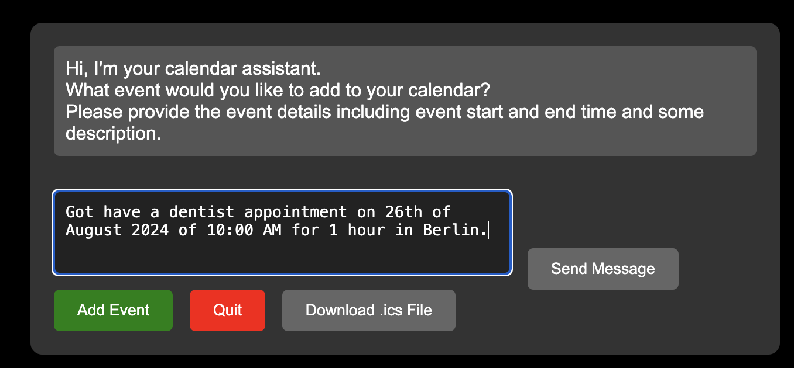

<p align="center">
  
</p>

# AI PLanner

AIPlanner is a Python based tool for transforming descriptions of events into an `.ics` file which can be added to any calendar application (e.g. Google Calendar, Outlook, etc.). 

-------------------

The tool uses a chat interface to interact with the user and extract the event's details. At its core, it hinges on the following technologies:

1. [Ollama](https://ollama.com/) for natural language understanding. Generates responses and interacts with the user to extract info of the event to be added to the calendar.
2. [Flask](https://flask.palletsprojects.com/en/2.0.x/) for the web interface and API. The user interacts with the tool through a web interface.

## Requirements

- at least 5.9 GB of free system memory to run Ollama llama3 model. llama3 model is the most lightweight model that generates acceptable responses. More advanced models can also be used but they require more memory. [Here](https://github.com/ollama/ollama#:~:text=Here%20are%20some%20example%20models%20that%20can%20be%20downloaded%3A) you can find other alternative models.

## Running the tool

Use docker compose to run the tool. The following command will build the docker image and run the tool on `127.0.0.1:5050`.

```bash
docker-compose up
```

The ollama base image (llama3) is about 4.7 GB, thus it will take some time to download and build the docker image.

## Usage and Interfacing

1. The user interacts with the tool through a web interface. The tool asks the user for the event's details and the user responds with the details by inserting them in the chat and pressing `Send Message` button.

<br>
<p align="center">
  
</p>

2. After sending the details, the tool will process the user's input and extract the event's details. Then it will ask the user if the details are correct. The user can either confirm the details by pressing the `Add Event` button, or correct the details by **reproviding all the details** and **furthur details** in the chat and sending them by pressing the `Send Message` button. Below is an example of the tool's response after processing the user's input:

<br>
<p align="center">
  
</p>

3. If the user confirms the details, the tool will finalize the event and add it to the calendar `.ics` file. The user can download the `.ics` file by pressing the `Download .ics File` button. Below is an example of the `.ics` file that is generated by the tool:

<br >

```ics
BEGIN:VCALENDAR
VERSION:2.0
PRODID:ics.py - http://git.io/lLljaA
BEGIN:VEVENT
DESCRIPTION:A dentist appointment scheduled for 26th of August 2024 at 10:00 AM for 1 hour in Berlin.
DTEND:20240826T110000Z
DTSTART:20240826T100000Z
SUMMARY:Dentist appointment
UID:fde1a775-46a8-4fa0-ae20-4ea837a77d86@fde1.org
END:VEVENT
END:VCALENDAR
```
<br >

4. The `.ics` file can be added to any calendar application (e.g. Google Calendar, Outlook, etc.) by importing it. Below an event after adding the `.ics` file to Outlook calendar:


<br>
<p align="center">
  
</p>