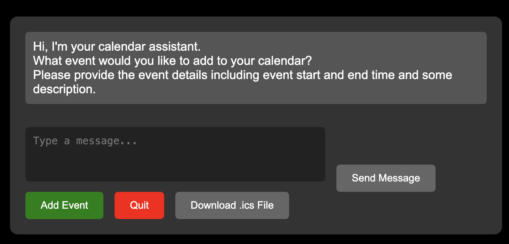

<p align="center">
  
</p>


# AIPLanner

AIPlanner is a Python based tool that adds events to google calendar based on the user's input using large language models.

At its core, the tool uses 2 main components which require manual setup before running the tool:

1. [Ollama](https://ollama.com/) for natural language understanding. Generates responses and interacts with the user to extract info of the event to be added to the calendar.
2. [Google Calendar API](https://developers.google.com/calendar) for adding events to one's calendar

Below is a chart illustrating the flow of the tool:

<div style="text-align: center;">
  
</div>

## Usage

1. The user interacts with the tool through a web interface. The tool asks the user for the event's details and the user responds with the details by typing them in the chat and pressing send button.

<br>

<div style="text-align: center;">
  
</div>

2. The tool uses Ollama to understand the user's input and extract the event's details. The tool then asks the user to confirm the details extracted from the user's input. Below is an example of the tool asking the user to confirm the event's details after extracting data about a dentist appointment:

<br>
<div style="text-align: center;">
  
</div>

3. The user confirms the event's details by pressing the `Add Event` button. The tool then adds the event to the user's Google Calendar. Below is an example of the event created in the user's Google Calendar:

<br>
<div style="text-align: center;">
  
</div>


## Installation and Setup

### 1. Clone the repository

```bash
git clone https://github.com/ahnazary/AIPlanner.git
```

### 2. Install the required packages

```bash
pip install -r requirements.txt
```

### 3. Setup the Google Calendar API

- prerequisite: 
    - Python 3.10.7 or greater
    - The pip package management tool
    - A Google Cloud project.
    - A Google account with Google Calendar enabled.

    3.1. After creating a [google cloud project](https://developers.google.com/workspace/guides/create-project), follow this [ python quickstart guide](https://developers.google.com/calendar/api/quickstart/python) to enable the Google Calendar API and download the `credentials.json` file to the root of the project (the downloaded file should be named `credentials.json`).
    
    3.2 Enable the Google Calendar API for the project. (see the [Google Calendar API documentation](https://developers.google.com/calendar/api/quickstart/python#enable_the_api) for more information)

    3.3 Follow the rest of the steps in the [python quickstart guide](https://developers.google.com/calendar/api/quickstart/python). At the end of the guide, you should be able to run the sample code and see a list of the user's calendar events.

### 4. Setup Ollama

    4.1 Downlaod and install Ollama following this Tutorial: [Ollama Installation](https://github.com/ollama/ollama?tab=readme-ov-file#:~:text=Get%20up%20and,Manual%20install%20instructions)

    4.2 Pull proper Ollama image 
    
    ```bash
    ollama pull llama3
    ```

    for this project, `Llama 3` model is leas recommended. simpler models do not generate well-formed responses.

    4.3 Build `aiplanner` model, with pre-instructions to act as a calendar event planner

    ```bash
    ollama create aiplanner -f ./Modelfile.txt
    ```

### 5. Run the tool

```bash
python ai_planner/src/app.py
```

head to `http://127.0.0.1:5000/` to interact with the tool:

<div style="text-align: center;">
  
</div>